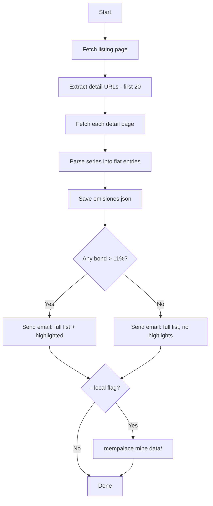

# BVA Emissions Scraper - Implementation Plan

## Problem Statement
Scrape the first 20 new emissions from Bolsa de Valores de Asunción (Paraguay), flatten each series into individual JSON entries with key fields (name, instrument, qualification, percentage, date, duration), send a daily email via Resend with all bonds listed and >11% interest ones highlighted, and optionally ingest into mempalace when running locally.

## Requirements
- Scrape listing page + detail pages to get first 30 emissions
- Flatten multi-series emissions into one entry per series
- JSON fields: name, instrument, qualification, percentage, date, duration
- Save `emisiones.json` locally
- Send email via Resend API: full list with >11% bonds highlighted, plus summary count
- Runs on GitHub Actions every Wednesday (primary execution)
- When run locally with `--local` flag, also ingest into mempalace via `mempalace mine`
- Secrets via `.env` locally, GitHub Secrets for Actions
- Project lives at the repository root (no nested folder)
- Python virtual environment (`.venv`) for local isolation

## Background
- The listing page at `/nuevas-emisiones/` shows ~12 cards initially with a "Cargar más" AJAX button. Each card links to a detail page.
- Detail pages contain: emission name (h2), instrument, calificación de riesgo, fecha de emisión, and per-series data (tasa de interés, plazo de vencimiento, etc.)
- The "Cargar más" button likely uses WordPress AJAX. We need 20 entries but only 12 show initially, so we must handle load-more (try `/page/2/` WordPress pattern or simulate AJAX call).
- MemPalace ingestion: save JSON to a directory, then run `mempalace mine <dir> --wing bva-emisiones`
- MemPalace lives at `/mydata/codes/2026/mempalace/.venv/bin`

## Architecture



## Task Breakdown

### Task 1: Project scaffolding with isolated Python venv
- **Objective:** Set up project structure at the repo root with virtual environment and dependencies.
- **Implementation:**
  - Set up `python -m venv .venv` at repo root
  - Create `requirements.txt` (requests, beautifulsoup4, resend, python-dotenv)
  - Create `.env.example` with: `RESEND_API_KEY`, `EMAIL_FROM`, `EMAIL_TO`
  - Create `.gitignore` (`.venv/`, `.env`, `__pycache__/`, `data/emisiones.json`)
  - Create `data/` directory with `.gitkeep`
- **Test:** `source .venv/bin/activate && pip install -r requirements.txt` succeeds
- **Demo:** Clean project structure ready for development.

### Task 2: Scrape listing page and collect detail URLs
- **Objective:** Fetch `https://www.bolsadevalores.com.py/nuevas-emisiones/`, extract up to 20 detail page URLs. Handle the "Cargar más" pagination — try fetching page 2 via WordPress `/page/2/` pattern, or simulate the AJAX call to `admin-ajax.php`.
- **Implementation:** Write function `get_detail_urls(n=20) -> list[str]` in `scraper.py`.
- **Test:** Run script, verify it prints 20 valid URLs.
- **Demo:** Script outputs 20 detail URLs to stdout.

### Task 3: Parse detail pages into flat JSON entries
- **Objective:** For each detail URL, fetch the page and extract: name (emission title), instrument, qualification (calificación de riesgo), date (fecha de emisión), and per-series: percentage (tasa de interés), duration (plazo de vencimiento). Flatten so each series is its own entry.
- **Implementation:** Write function `parse_emission(url) -> list[dict]` that returns one dict per series.
- **JSON shape per entry:**
  ```json
  {
    "name": "BANCO FAMILIAR S.A.E.C.A.",
    "instrument": "bono",
    "qualification": "AApy Estable.",
    "percentage": "5.65%",
    "date": "2026-04-23",
    "duration": 732
  }
  ```
- **Test:** Run against one known URL, verify fields are correctly extracted.
- **Demo:** Script fetches all 20 emissions, prints flattened JSON array to stdout.

### Task 4: Save JSON to file and wire main flow
- **Objective:** Wire `get_detail_urls` → `parse_emission` for each → save to `data/emisiones.json`. Add CLI argument parsing with `argparse` for `--local` flag.
- **Test:** Run `python scraper.py`, verify `data/emisiones.json` is created with correct structure.
- **Demo:** Running the script produces a complete `emisiones.json` file.

### Task 5: Email via Resend with highlighted bonds
- **Objective:** Build an HTML email with a table of all bonds. Rows where `percentage > 11%` get a highlighted background. Include a summary line at the top: "X bonds found, Y with interest > 11%". Send via Resend API using env vars.
- **Implementation:** Load `RESEND_API_KEY`, `EMAIL_FROM`, `EMAIL_TO` from `.env`.
- **Test:** Run with valid Resend key, verify email arrives with correct formatting.
- **Demo:** Email received with full table, >11% rows visually highlighted, summary count at top.

### Task 6: MemPalace integration for local runs
- **Objective:** When `--local` flag is passed, after saving JSON, ingest into mempalace using the mempalace venv.
- **Implementation:** Use `subprocess.run()` to call:
  ```bash
  /mydata/codes/2026/mempalace/.venv/bin/python -m mempalace mine data/ --wing bva-emisiones
  ```
- **Test:** Run `python scraper.py --local`, verify mempalace ingests the data.
- **Demo:** Data appears in mempalace search results via `mempalace search "emisiones"`.

### Task 7: GitHub Actions workflow (primary execution)
- **Objective:** Create `.github/workflows/bva-scraper.yml` that runs every Wednesday and supports manual triggers.
- **Implementation:**
  - Cron: `0 12 * * 3` (noon UTC every Wednesday, ~8am Paraguay)
  - `workflow_dispatch` for manual testing
  - `pip install -r requirements.txt` (no venv in Actions)
  - Secrets: `RESEND_API_KEY`, `EMAIL_FROM`, `EMAIL_TO`
- **Test:** Push to repo, trigger manually via `workflow_dispatch`, verify Action runs and email is sent.
- **Demo:** GitHub Action runs successfully, email is sent with bond data.
