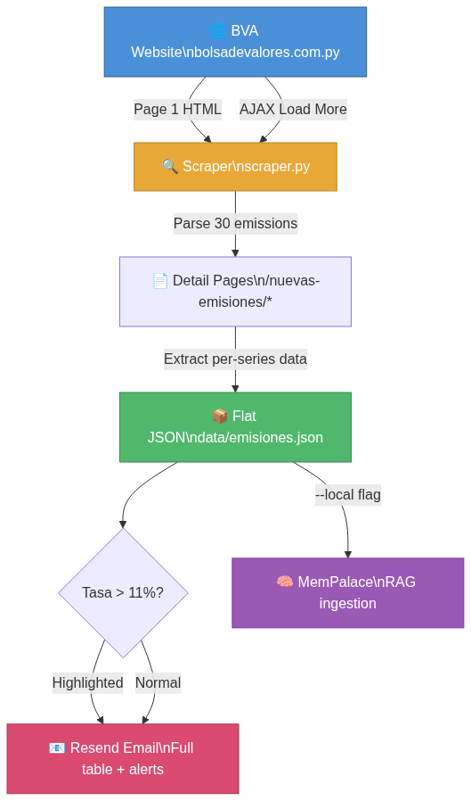
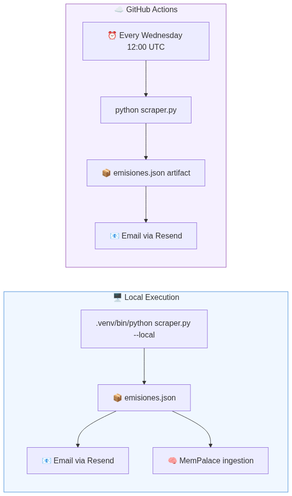
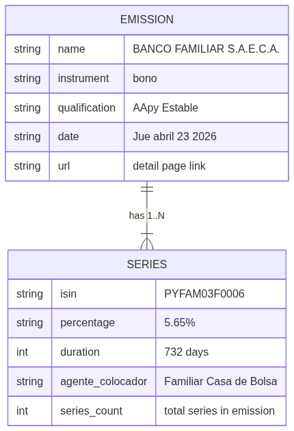
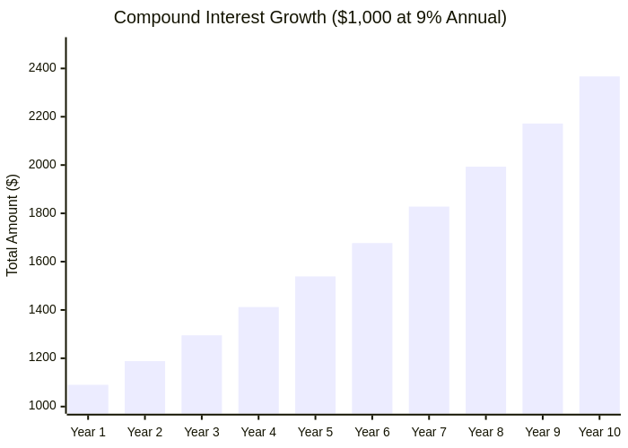

# 📊 BVA Emissions Scraper

Scrapes the latest bond emissions from [Bolsa de Valores de Asunción](https://www.bolsadevalores.com.py/nuevas-emisiones/) (Paraguay), flattens multi-series emissions into individual entries, and sends email alerts when bonds exceed a configurable interest rate threshold.

## Architecture



The scraper fetches the listing page, handles AJAX pagination (JetEngine "Cargar más"), visits each detail page, and extracts per-series data into a flat JSON structure.

## Execution Environments



Runs locally with optional [MemPalace](https://github.com/MemPalace/mempalace) RAG ingestion, or on GitHub Actions every Tuesday and Thursday.

## Data Model



Each emission can contain multiple series. The scraper flattens them so every series is its own JSON entry with the parent emission's metadata.

### JSON Output Fields

| Field | Example | Description |
|---|---|---|
| `name` | BANCO FAMILIAR S.A.E.C.A. | Issuer name |
| `instrument` | bono | Instrument type |
| `qualification` | AApy Estable. | Risk rating |
| `percentage` | 5,65% | Interest rate |
| `date` | Jue, abril 23, 2026 | Emission date |
| `duration` | 732 | Term in days |
| `isin` | PYFAM03F0006 | ISIN code |
| `agente_colocador` | Familiar Casa de Bolsa S.A | Placement agent |
| `series_count` | 3 | Total series in the emission |
| `url` | https://...banco-familiar.../ | Detail page URL |
| `scraped_at` | 2026-04-21T16:00:13Z | UTC timestamp of scrape execution |

## Pre-requisites

- **Python 3.9+**
- **pip** (comes with Python)
- A [Resend](https://resend.com) account and API key (for email alerts)
- *(Optional)* [MemPalace](https://github.com/MemPalace/mempalace) installed locally for RAG ingestion

## Setup

```bash
# 1. Clone the repo
git clone <repo-url> && cd bons-reader-py

# 2. Create virtual environment and install dependencies
python3 -m venv .venv
source .venv/bin/activate
pip install -r requirements.txt

# 3. Configure environment variables
cp .env.example .env
# Edit .env with your values:
#   RESEND_API_KEY=re_xxxxxxxxxxxx
#   EMAIL_FROM=onboarding@resend.dev
#   EMAIL_TO=you@example.com
#   MEMPALACE_BIN=/path/to/mempalace  (optional, for --local mode)
```

## Usage

```bash
# Full run: scrape + save JSON + send email
.venv/bin/python scraper.py

# Scrape only, no email (for testing)
.venv/bin/python scraper.py --no-email

# Local run with MemPalace ingestion
.venv/bin/python scraper.py --local
```

Output is saved to `data/emisiones.json`.

## Email Alert

The email includes:
- **Summary** — total series count and how many exceed the interest threshold (default: 11%)
- **Highlighted bonds** — listed at the top with ⚠️ warning
- **Full table** — all series with rows above threshold highlighted in yellow

Columns: Nombre, Instrumento, Calificación, Tasa, Fecha, Plazo, ISIN, Agente Colocador.

## Testing Email Locally

1. Create a free account at [resend.com](https://resend.com) and grab your API key.
2. Copy and edit the env file:
   ```bash
   cp .env.example .env
   ```
3. Fill in your values:
   ```
   RESEND_API_KEY=re_your_actual_key
   EMAIL_FROM=onboarding@resend.dev
   EMAIL_TO=your-email@example.com
   ```
   > **Note:** If you haven't verified a custom domain in Resend, use `onboarding@resend.dev` as the sender. In that case, `EMAIL_TO` must match your Resend account email.

4. Run the scraper with email enabled:
   ```bash
   .venv/bin/python scraper.py
   ```
5. To test scraping without sending email:
   ```bash
   .venv/bin/python scraper.py --no-email
   ```

## MemPalace Integration

[MemPalace](https://github.com/MemPalace/mempalace) is a local-first AI memory system that stores content as verbatim text and retrieves it via semantic search. It organizes data into *wings* (projects), *rooms* (topics), and *drawers* (content) — all indexed locally with no API calls required.

When you run the scraper with `--local`, it automatically ingests the scraped emissions into MemPalace so you can later query them with natural language, e.g.:

```bash
# After running the scraper with --local
mempalace search "bonds with high interest rate"
```

The scraper calls `mempalace mine` automatically. If you want to manually ingest an updated `data/emisiones.json`, use:

```bash
./ingest-mempalace.sh
```

This script reads your local `MEMPALACE_BIN` from the `.env` file.

## GitHub Actions

The workflow runs every Tuesday and Thursday at 12:00 UTC (~8am Paraguay time) and can also be triggered manually.

### Required Secrets

Add these in your repo → Settings → Secrets and variables → Actions:

| Secret | Description |
|---|---|
| `RESEND_API_KEY` | Your Resend API key |
| `EMAIL_FROM` | Sender email (e.g. `alerts@yourdomain.com`) |
| `EMAIL_TO` | Recipient(s), comma-separated |

### Manual Trigger

Go to Actions → BVA Emissions Scraper → Run workflow.

## Project Structure

```
.
├── scraper.py                          # Main script
├── requirements.txt                    # Python dependencies
├── .env.example                        # Environment variables template
├── AGENTS.md                           # LLM/MemPalace context file
├── .gitignore
├── data/
│   ├── .gitkeep
│   └── emisiones.json                  # Output (git-ignored)
├── docs/
│   ├── architecture.png
│   ├── environments.png
│   └── data-model.png
├── .github/workflows/bva-scraper.yml   # GitHub Actions workflow
├── PLAN.md                             # Implementation plan
└── README.md
```

## How It Works

1. **Fetch listing page** — GET `/nuevas-emisiones/`, extract detail URLs from `data-url` attributes
2. **AJAX pagination** — POST to `admin-ajax.php` with JetEngine params and signature to load more entries beyond the initial 12
3. **Parse detail pages** — For each emission, extract name, instrument, qualification, date, and per-series: ISIN, interest rate, duration, placement agent
4. **Flatten** — Each series becomes its own JSON entry with parent emission metadata
5. **Save** — Write to `data/emisiones.json`
6. **Email** — Send via Resend with full table and highlighted rows for bonds > 11%
7. **MemPalace** *(local only)* — Ingest `data/` into mempalace for RAG search

## Financial Formulas

For academic reference, here are the formulas used to understand bond returns and interest accumulation.

### 1. Compound Interest
Used to calculate the total amount of an investment over time when interest is reinvested. In Paraguay, entities like **Cadiem** and **Investor** offer products like *Fondo Mutuo* that utilize compound interest by reinvesting daily yields.

$$A = P \left(1 + \frac{r}{n}\right)^{nt}$$

- **A**: Final amount (Principal + Interest)
- **P**: Principal (Initial investment)
- **r**: Annual interest rate (decimal)
- **n**: Number of times interest is compounded per year
- **t**: Number of years

### 2. Bond Interest (Coupon)
The periodic interest payment a bondholder receives from the bond's issuance date until it matures. Unlike compound interest, bond coupons are typically paid out (not reinvested automatically).

**Practical Example:**
- **Issuer:** TAPE RUVICHA S.A.E.C.A.
- **Principal:** 30,000,000 PYG (Approx. **$4,000 USD** at 7,500 PYG/USD)
- **Annual Rate:** 12.35%

$$C = \$4,000 \times 0.1235 = \$494 \text{ per year}$$

| Payment Period | Interest (USD) | Interest (PYG) |
| :--- | :--- | :--- |
| Quarterly | $123.50 | 926,250 PYG |
| Semi-Annual | $247.00 | 1,852,500 PYG |
| **Annual Total** | **$494.00** | **3,705,000 PYG** |

### 🥊 The 5-Year Showdown: Compound vs. Bond
What happens if you hold both for 5 years with a **$4,000** initial capital?

| Investment Type | Annual Rate | Total Interest (5yr) | Final Value |
| :--- | :--- | :--- | :--- |
| **Fondo Mutuo** (Compound) | 9.00% | $2,154.48 | $6,154.48 |
| **Tape Ruvicha Bond** (Simple) | 12.35% | $2,470.00 | $6,470.00 |
| **Delta (Difference)** | **+3.35%** | **$315.52** | **Bond wins!** |

*Note: In the long run (15+ years), the power of compounding usually overtakes higher simple interest rates, but for shorter terms, the raw yield of high-rate bonds is often superior.*

$$C = F \times c$$

- **C**: Coupon payment amount
- **F**: Face value (Par value) of the bond
- **c**: Coupon rate (Annual interest rate)

### Visual Representation



| Year | Interest (9%) | Total Capital |
| :--- | :--- | :--- |
| 1 | $90.00 | $1,090.00 |
| 2 | $98.10 | $1,188.10 |
| 3 | $106.93 | $1,295.03 |
| 4 | $116.55 | $1,411.58 |
| 5 | $127.04 | $1,538.62 |
| 6 | $138.48 | $1,677.10 |
| 7 | $150.94 | $1,828.04 |
| 8 | $164.52 | $1,992.56 |
| 9 | $179.33 | $2,171.89 |
| 10 | $195.47 | $2,367.36 |

## License

MIT
